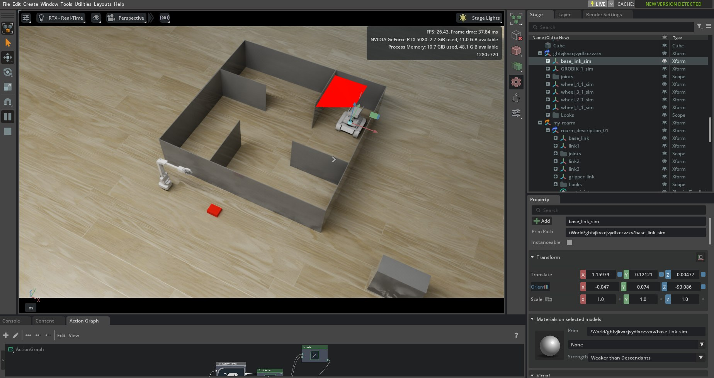
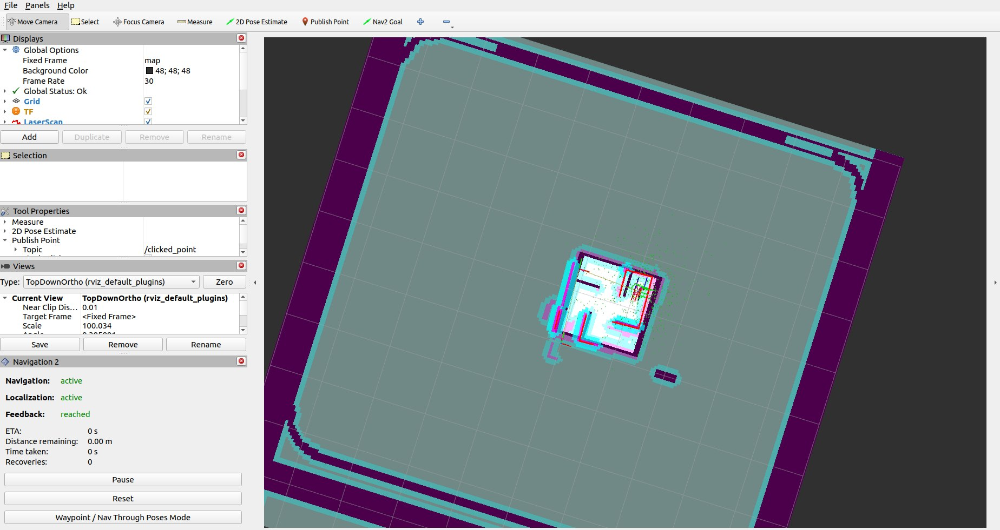
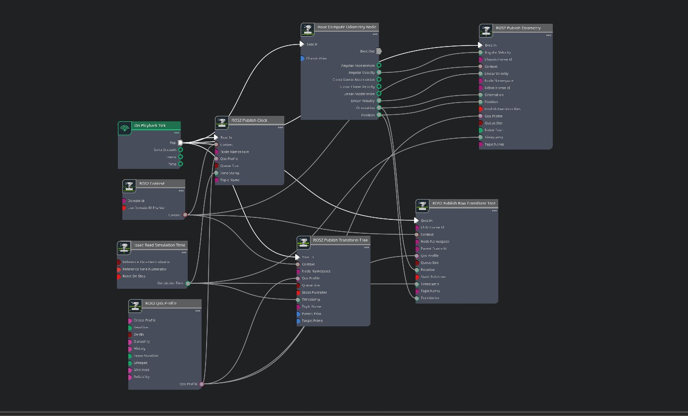
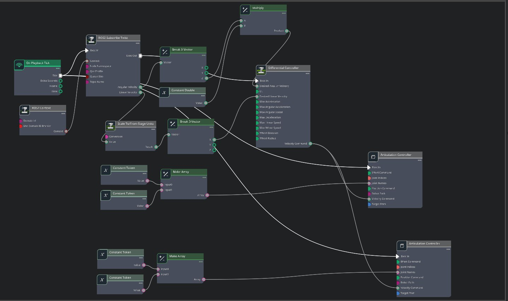
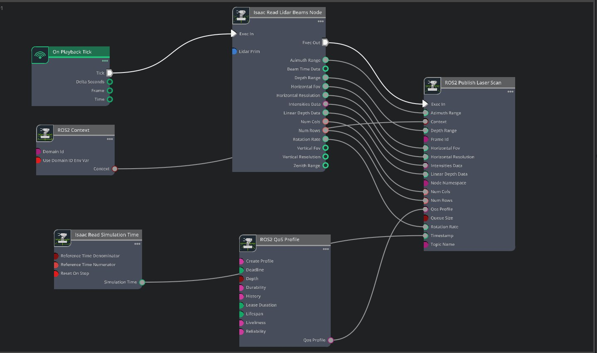
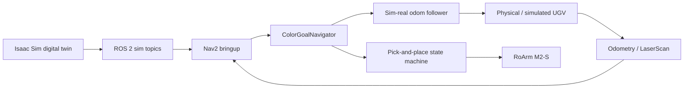
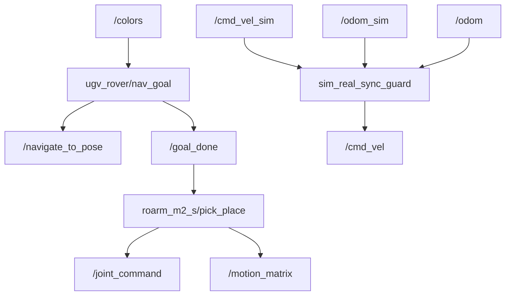

# UGV Rover Robotics Stack

[](#quick-start)
[](#ros2-packages)
[](#simulation)
[](#ros2-packages)

An integrated robotics project for a small UGV rover with ROS 2 navigation, Isaac Sim digital-twin control, map-based autonomy, and a RoArm M2-S pick-and-place workflow.

The repository is organized so it can be uploaded directly to GitHub: source packages live in `ros2_ws/src`, documentation and screenshots live in `docs`, and generated ROS build artifacts are ignored by Git.

## Gallery

<table>
  <tr>
    <td width="50%"></td>
    <td width="50%"></td>
  </tr>
  <tr>
    <td align="center"><b>Isaac Sim digital twin</b></td>
    <td align="center"><b>RViz / Nav2 map</b></td>
  </tr>
</table>

<table>
  <tr>
    <td></td>
    <td></td>
    <td></td>
  </tr>
  <tr>
    <td align="center"><b>Odometry bridge</b></td>
    <td align="center"><b>Command bridge</b></td>
    <td align="center"><b>Lidar bridge</b></td>
  </tr>
</table>

## System Overview



The project has three main loops:

1. **Navigation loop**: Nav2 consumes map, odometry, TF, and LaserScan data to drive the rover toward goals.
2. **Simulation-to-real loop**: simulated `/cmd_vel` and odometry are corrected before publishing real rover commands.
3. **Manipulation loop**: detected cube color selects a navigation route and a matching RoArm pick/place sequence.

More diagrams are in [docs/architecture.md](docs/architecture.md).

## ROS2 Packages

| Package | Purpose | Main commands |
| --- | --- | --- |
| `ugv_rover` | Color-based goal sequencing, sim/real odometry sync, rover joint/cube control | `nav_goal`, `sim_real_sync_guard`, `cube` |
| `ugv_navigation2` | Nav2 launch files, RViz configs, real/sim params, occupancy map | `bringup_launch.py`, `bringup_real.launch.py` |
| `roarm_m2_s` | RoArm M2-S control, camera/color pipeline, pick-and-place sequence | `roarm`, `camera2`, `pick_place` |
| `ghfvjkvxcjvydfxczvzxv_description` | Robot description package exported from CAD/Isaac tooling | `display.launch.py`, `gazebo.launch.py` |

## Repository Layout

```text
robotics/
├── README.md
├── docs/
│   ├── architecture.md
│   ├── setup.md
│   └── assets/
│       ├── photos/
│       └── videos/
├── ros2_ws/
│   ├── README.md
│   └── src/
│       ├── ugv_rover/
│       ├── ugv_navigation2/
│       ├── roarm_m2_s/
│       └── ghfvjkvxcjvydfxczvzxv_description/
├── simulation/
│   └── navigation.usd
└── archive/
    └── original_packages/
```

## Quick Start

```bash
cd ros2_ws
source /opt/ros/humble/setup.bash
rosdep install --from-paths src --ignore-src -r -y
colcon build --symlink-install
source install/setup.bash
```

Launch the main systems:

```bash
# Nav2 for the real rover map
ros2 launch ugv_navigation2 bringup_real.launch.py

# UGV goal sequencing + sim-real command synchronization
ros2 launch ugv_rover ugv_all.launch.py

# RoArm pick-and-place nodes
ros2 launch roarm_m2_s roarm_all.launch.py
```

Open the robot description:

```bash
ros2 launch ghfvjkvxcjvydfxczvzxv_description display.launch.py
```

Detailed setup notes are in [docs/setup.md](docs/setup.md).

## Publish To GitHub

Create an empty repository on GitHub, then run:

```bash
cd /Users/adilkhankaldybekov/Desktop/adilkhan/ICT/robotics
git remote add origin https://github.com/<your-username>/<your-repo>.git
git push -u origin main
```

The repository is already initialized on branch `main` with the first commit.

## Key Topics



## Simulation

The Isaac Sim scene is stored in [simulation/navigation.usd](simulation/navigation.usd). The screenshots in `docs/assets/photos` show the OmniGraph ROS2 bridges for clock, odometry, transform tree, LaserScan, and Twist command flow.

## Media

Demo videos are stored in [docs/assets/videos](docs/assets/videos). They are intentionally kept outside the ROS workspace so the source tree stays focused on code and launch files.

## Notes

- `build/`, `install/`, and `log/` are ignored by Git because they are generated by `colcon`.
- The original exported robot-description archive is preserved in `archive/original_packages`.
- The active map is packaged inside `ros2_ws/src/ugv_navigation2/map/my_map.yaml`, so launch files no longer depend on a local absolute path.
