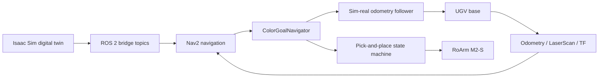
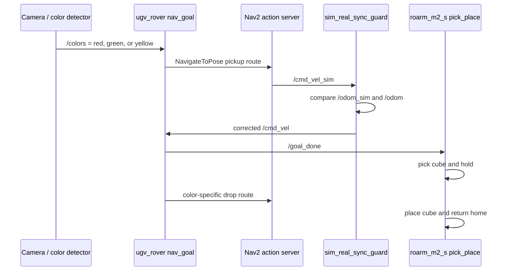

# UGV + Manipulator Autonomous Robot

<div align="center">

[](#quick-start)
[](#simulation)
[](#ros-2-packages)
[](#ros-2-packages)
[](LICENSE)

**Autonomous ground rover with ROS 2 navigation, an Isaac Sim digital twin, and RoArm M2-S color-based pick-and-place.**

[Screenshots](#screenshots) | [Architecture](#system-architecture) | [Quick Start](#quick-start) | [Packages](#ros-2-packages)

</div>

---

## Screenshots

### Isaac Sim and RViz

<table>
  <tr>
    <td width="50%">
      
    </td>
    <td width="50%">
      
    </td>
  </tr>
  <tr>
    <td align="center"><b>Isaac Sim digital twin</b><br/><sub>UGV, RoArm, maze environment, and cube target.</sub></td>
    <td align="center"><b>RViz / Nav2</b><br/><sub>Occupancy map, localization, LaserScan, and navigation feedback.</sub></td>
  </tr>
</table>

### Isaac Sim Action Graphs

<table>
  <tr>
    <td>
      
    </td>
    <td>
      
    </td>
  </tr>
  <tr>
    <td align="center"><b>Odometry + TF publishing</b></td>
    <td align="center"><b>LiDAR to ROS 2 LaserScan</b></td>
  </tr>
  <tr>
    <td colspan="2">
      
    </td>
  </tr>
  <tr>
    <td colspan="2" align="center"><b>Twist command, differential drive, and articulation control pipeline</b></td>
  </tr>
</table>

## System Architecture

```text
+------------------------------------------------------------------+
|                         NVIDIA Isaac Sim                         |
|                                                                  |
|   +-------------+    +--------------+    +--------------------+   |
|   | UGV Rover   |    | RoArm M2-S   |    | Maze + cube scene  |   |
|   | 4-wheel base|    | 4-DOF arm    |    | navigation.usd     |   |
|   +------+------+    +------+-------+    +--------------------+   |
|          |                  |                                      |
|          +------------------+                                      |
|                             |                                      |
|   +-------------------------v----------------------------------+   |
|   | Isaac Sim Action Graphs / OmniGraph                       |   |
|   | - ROS 2 clock, odometry, TF, and transform tree           |   |
|   | - LiDAR beams to LaserScan                                |   |
|   | - Twist subscriber to differential drive controller        |   |
|   | - Articulation controller for arm joints                  |   |
|   +-------------------------+----------------------------------+   |
+-----------------------------|--------------------------------------+
                              | ROS 2 topics and TF
+-----------------------------v--------------------------------------+
|                            ROS 2 Humble                           |
|                                                                  |
|   +----------------+    +------------------+    +-------------+   |
|   | Nav2 stack     |    | Color pipeline   |    | RoArm node  |   |
|   | AMCL, planner, |<---| /colors topic    |--->| pick/place  |   |
|   | controller     |    | camera2.py       |    | sequencer   |   |
|   +-------+--------+    +------------------+    +------+------+   |
|           |                                           |          |
|   +-------v--------------------+              +-------v-------+   |
|   | ugv_rover mission logic    |              | /joint_command|   |
|   | /navigate_to_pose, /cmd_vel|              | /motion_matrix|   |
|   +----------------------------+              +---------------+   |
+------------------------------------------------------------------+
```



## Robot Behavior Flow



## ROS 2 Packages

| Package | Path | Purpose | Main commands |
| --- | --- | --- | --- |
| `ugv_rover` | `ros2_ws/src/ugv_rover` | Mission logic, color-goal routing, sim/real odometry sync, rover helpers | `nav_goal`, `sim_real_sync_guard`, `cube` |
| `ugv_navigation2` | `ros2_ws/src/ugv_navigation2` | Nav2 launch files, maps, params, RViz configs | `bringup_launch.py`, `bringup_real.launch.py` |
| `roarm_m2_s` | `ros2_ws/src/roarm_m2_s` | Camera/color input and RoArm M2-S pick-and-place sequencing | `roarm`, `camera2`, `pick_place` |
| `ghfvjkvxcjvydfxczvzxv_description` | `ros2_ws/src/ghfvjkvxcjvydfxczvzxv_description` | Robot description package with URDF, USD, STL meshes, and visualization launch files | `display.launch.py`, `gazebo.launch.py` |

## Repository Structure

```text
robotics/
|-- README.md                         # Main GitHub presentation
|-- LICENSE                           # MIT license
|-- docs/
|   |-- architecture.md               # Additional diagrams and topic notes
|   |-- setup.md                      # Detailed setup instructions
|   |-- media.md                      # Screenshot and video index
|   `-- assets/
|       |-- photos/                   # Isaac Sim, RViz, OmniGraph screenshots
|       `-- videos/                   # Demo and field-test videos
|-- ros2_ws/
|   |-- README.md                     # ROS workspace notes
|   `-- src/
|       |-- ugv_rover/                # Mission logic and sim-real sync
|       |-- ugv_navigation2/          # Nav2 params, map, launch, RViz
|       |-- roarm_m2_s/               # RoArm control and pick/place scripts
|       `-- ghfvjkvxcjvydfxczvzxv_description/
|                                      # Robot URDF/USD/STL description
|-- simulation/
|   |-- README.md                     # Isaac Sim notes
|   `-- navigation.usd                # Main Isaac Sim scene
`-- archive/
    `-- original_packages/            # Original exported package archive
```

## Quick Start

### Requirements

- Ubuntu 22.04 style ROS environment
- ROS 2 Humble
- Python 3.10
- Nav2 and RViz2
- NVIDIA Isaac Sim for `simulation/navigation.usd`

### Build Workspace

```bash
cd ros2_ws
source /opt/ros/humble/setup.bash
rosdep install --from-paths src --ignore-src -r -y
colcon build --symlink-install
source install/setup.bash
```

### Launch Navigation

```bash
ros2 launch ugv_navigation2 bringup_real.launch.py
```

The packaged map is loaded from:

```text
ros2_ws/src/ugv_navigation2/map/my_map.yaml
```

### Launch Rover Mission Logic

```bash
ros2 launch ugv_rover ugv_all.launch.py
```

### Launch RoArm Pick-and-Place

```bash
ros2 launch roarm_m2_s roarm_all.launch.py
```

### View Robot Description

```bash
ros2 launch ghfvjkvxcjvydfxczvzxv_description display.launch.py
```

More detailed setup notes are in [docs/setup.md](docs/setup.md).

## Simulation

The main Isaac Sim scene is [simulation/navigation.usd](simulation/navigation.usd). It is paired with OmniGraph ROS 2 bridges for odometry, TF, LaserScan, clock, command velocity, differential drive, and arm articulation control.

See [simulation/README.md](simulation/README.md) for the simulation notes and [docs/architecture.md](docs/architecture.md) for more topic-level diagrams.

## Media

Demo videos are stored in [docs/assets/videos](docs/assets/videos). They are kept outside the ROS workspace so the source tree stays focused on code, launch files, maps, and robot descriptions.

## Notes

- `build/`, `install/`, and `log/` are generated by `colcon` and ignored by Git.
- ROS package names are intentionally preserved so existing launch files continue to work.
- The robot description package keeps its exported name, but README tables describe its role clearly.
