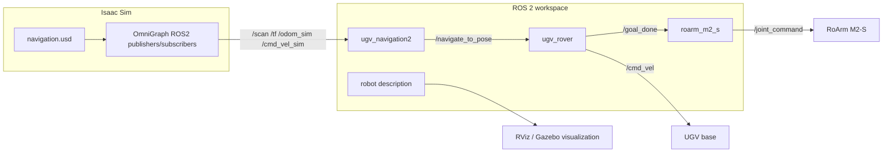
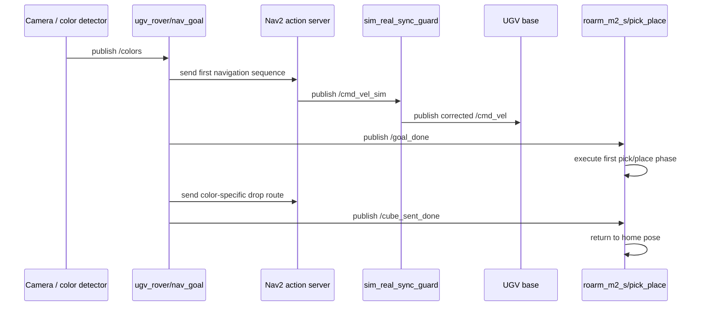
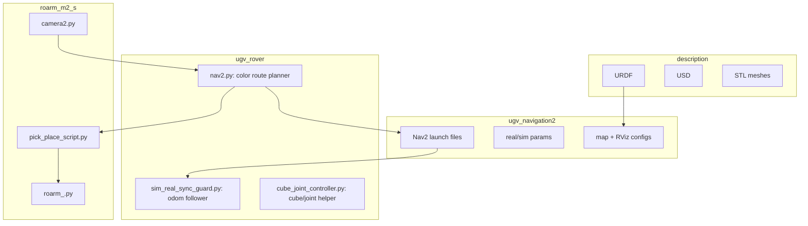

# Architecture

This project combines a ROS 2 rover stack, Nav2 localization/navigation, Isaac Sim topic bridges, and a RoArm pick-and-place workflow.

## High-Level Data Flow

## Navigation and Manipulation Sequence

## Package Responsibilities

## Important Runtime Topics

| Topic | Direction | Used by |
| --- | --- | --- |
| `/colors` | perception to planner | `ugv_rover.nav2`, `roarm_m2_s.pick_place_script` |
| `/navigate_to_pose` | planner to Nav2 | `ugv_rover.nav2` |
| `/goal_done` | rover to arm | `ugv_rover.nav2`, `roarm_m2_s.pick_place_script` |
| `/cube_sent_done` | rover status | `ugv_rover.nav2` |
| `/cmd_vel_sim` | simulation command | `sim_real_sync_guard` |
| `/cmd_vel` | real rover command | base controller |
| `/odom_sim` | simulation odometry | `sim_real_sync_guard` |
| `/odom` | real odometry | Nav2 and `sim_real_sync_guard` |
| `/joint_command` | arm command | RoArm / Isaac bridge |
| `/motion_matrix` | arm motion plan | Isaac/visualization integration |
